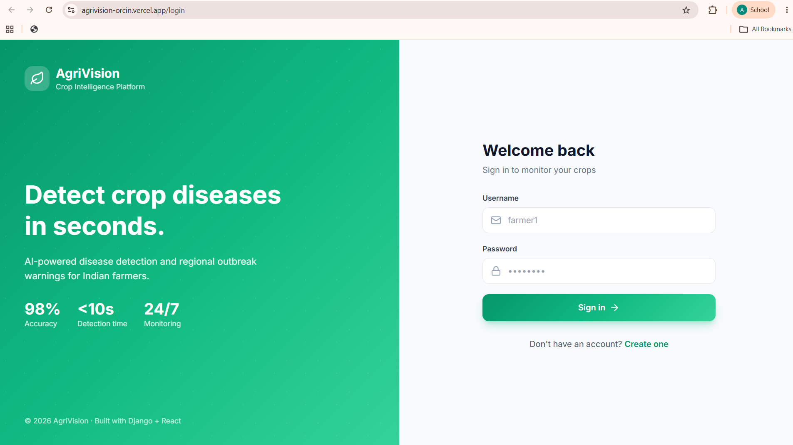
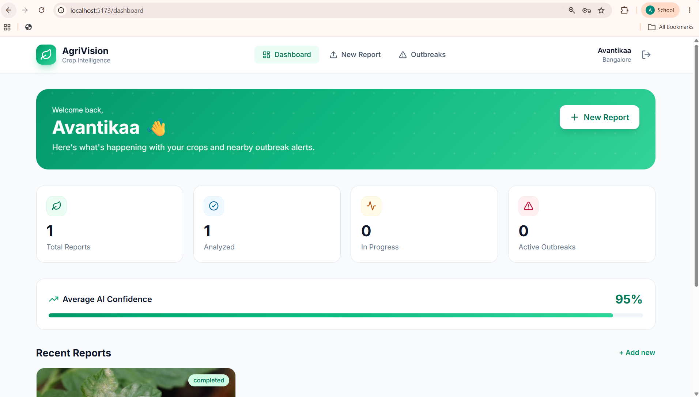
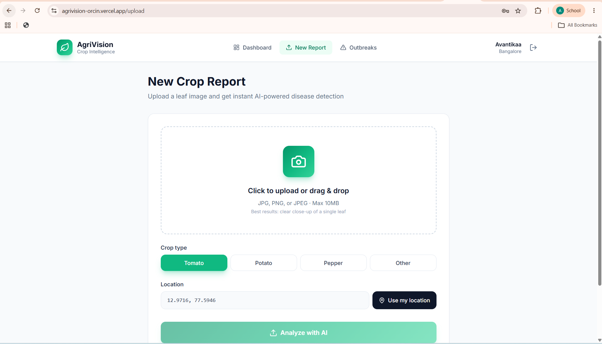
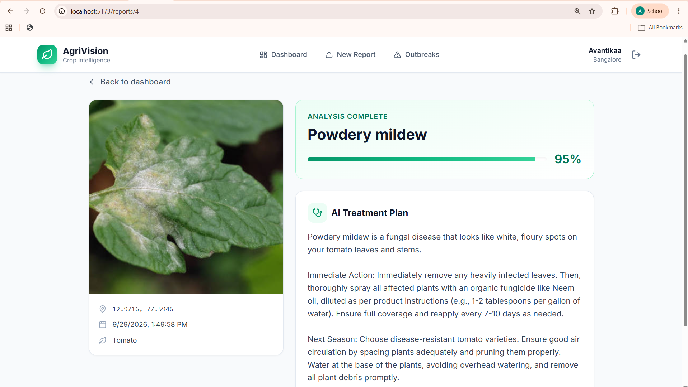

<div align="center">

# 🌱 AgriVision

### AI-powered crop disease detection & regional outbreak intelligence

[](https://agrivision-orcin.vercel.app)
[](https://agrivision-45zi.onrender.com/api/docs/)
[](https://github.com/avantikaar/agrivision)

**Live Demo:** [agrivision-orcin.vercel.app](https://agrivision-orcin.vercel.app) · **Test account:** `farmer1` / `testpass123`

</div>

---

## 📸 Screenshots

### Login


### Dashboard


### Upload Report


### AI Diagnosis Result


---

## 📌 Overview

**AgriVision** is a full-stack web platform that lets farmers photograph a sick crop leaf and receive an AI-powered diagnosis, treatment plan, and regional outbreak warning — all within seconds.

The project addresses a real problem: **86% of Indian farmers are smallholders who lose 20–30% of their crop every year to preventable diseases**, with only ~1 agricultural extension officer available per 1,000+ farmers.

The platform:
- Accepts geotagged crop reports with photos
- Runs each image through an AI classification pipeline
- Generates multi-language treatment plans
- Detects regional outbreaks by aggregating reports per district

---

## ✨ Features

| Feature | Description |
|---|---|
| 🧠 **AI Disease Detection** | Google Gemini 2.5 Flash Vision classifies crop diseases from leaf photos with structured JSON output |
| 💬 **Multi-Language Treatment Plans** | LLM-generated treatment guidance in English, Hindi, Kannada, and Tamil with specific dosages |
| ⚠️ **Regional Outbreak Detection** | Aggregates geotagged reports per district; fires alerts when 3+ reports of the same disease appear within 7 days |
| 🔐 **JWT Authentication** | Access + refresh tokens with role-based permissions (farmer vs admin) |
| 📊 **Analytics Dashboard** | Confidence trends, recent reports, and active outbreak cards |
| 📱 **Mobile-Responsive UI** | Built mobile-first — works on phones where farmers actually use it |

---


### The AI Processing Pipeline

Every report flows through a **3-stage Celery chain**:

| Stage | Task | Responsibility |
|-------|------|----------------|
| 1 | `classify_disease` | Sends image to Gemini Vision → parses structured disease JSON |
| 2 | `build_treatment` | Generates multi-language treatment plan via LLM |
| 3 | `save_results` | Persists results, triggers regional outbreak check |

This design **decouples slow LLM calls from the HTTP request lifecycle**, keeping API response times low while AI processing runs asynchronously.

> **Production deployment note:** The free-tier deployment runs the AI pipeline synchronously to avoid background-worker infrastructure costs. The Celery + Redis architecture is fully implemented in the codebase and can be enabled by setting `USE_CELERY=true`.

---

## 🛠️ Tech Stack

**Backend**
- Django 5.1 + Django REST Framework
- PostgreSQL (managed on Render)
- Celery 5.4 + Redis for async task pipelines
- JWT auth via `djangorestframework-simplejwt`
- Gunicorn + WhiteNoise for production serving
- drf-spectacular for auto-generated OpenAPI docs

**AI Layer**
- Google Gemini 2.5 Flash (Vision + Text)
- Multi-language generation (EN, HI, KN, TA)
- Structured JSON output parsing with error handling

**Frontend**
- React 18 + TypeScript
- Vite build system
- Tailwind CSS design system
- React Router for SPA routing
- Axios with JWT interceptors
- Lucide icon set

---

## 🔌 API Reference

| Method | Endpoint | Description | Auth |
|---|---|---|---|
| POST | `/api/auth/register/` | Register a new farmer | ❌ |
| POST | `/api/auth/login/` | Obtain JWT access + refresh tokens | ❌ |
| POST | `/api/auth/refresh/` | Refresh an expired access token | ❌ |
| GET | `/api/auth/me/` | Get the authenticated user | ✅ |
| POST | `/api/reports/` | Upload a crop report (multipart/form-data) | ✅ |
| GET | `/api/reports/` | List the user's reports (paginated) | ✅ |
| GET | `/api/reports/{id}/` | Retrieve a report with AI results | ✅ |
| GET | `/api/outbreaks/` | List active outbreak alerts | ✅ |
| GET | `/api/docs/` | Interactive Swagger UI | ❌ |

---

## 🧪 Testing

```bash
$ pytest -v
========================= 5 passed in 5.26s =========================
